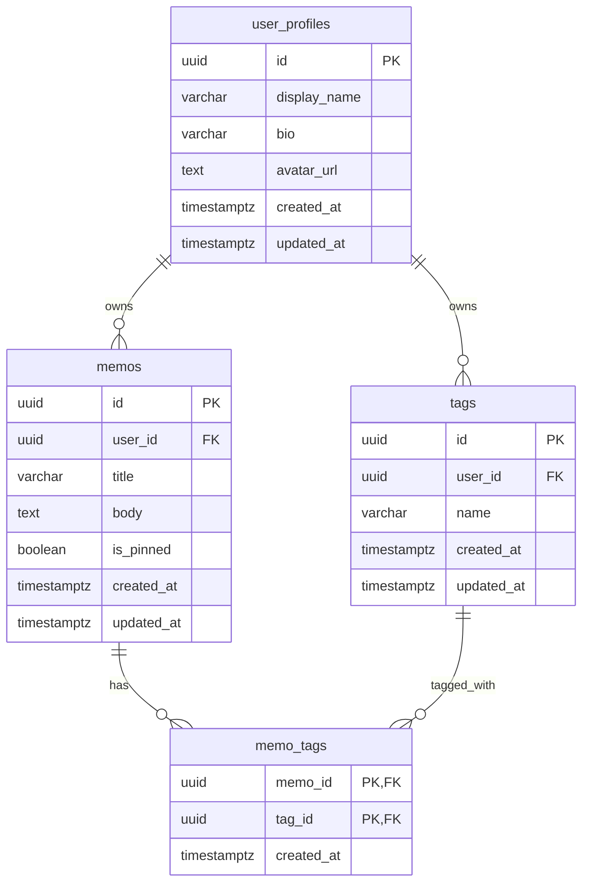

# データベース設計書（DB Schema）

本ドキュメントは、メモアプリのPostgreSQLテーブル設計を定義する。
[requirements.md](./requirements.md) / [architecture.md](./architecture.md) と併せて参照すること。

---

## 1. 設計方針

### 1.1 基本方針

- **DBMS**: PostgreSQL（Docker上で起動）
- **マイグレーション**: Alembic（FastAPI/SQLAlchemyとの相性で採用）
- **命名規約**: テーブル名は **snake_case・複数形**（例: `memos`, `tags`, `memo_tags`）
- **主キー**: 全テーブルで **UUID** を採用（v4）
- **タイムスタンプ**: 全テーブルに `created_at` / `updated_at` を保持（`timestamptz`）
- **削除方式**: フェーズ1では **物理削除** で実装

### 1.2 フェーズ2を見据えた設計

- 認証機能は **フェーズ2** で実装するが、データモデルには **`user_id` を最初から保持** する
- フェーズ1では、シード投入された **仮ユーザー1名（固定UUID）** を全レコードに紐付ける
- フェーズ2移行時に「`users` テーブルを追加 → 既存の `user_id` を実ユーザーに移行」だけで済むようにする

### 1.3 共通カラム

全テーブルに以下を含める。

| カラム名      | 型             | 制約                | 説明                  |
|---------------|----------------|---------------------|----------------------|
| `id`          | `uuid`         | PRIMARY KEY         | 一意識別子（UUID v4） |
| `created_at`  | `timestamptz`  | NOT NULL, DEFAULT now() | 作成日時          |
| `updated_at`  | `timestamptz`  | NOT NULL, DEFAULT now() | 最終更新日時      |

> `updated_at` はアプリケーション側（SQLAlchemyの `onupdate`）またはDBトリガーで自動更新する。フェーズ1ではSQLAlchemy側で管理する方針。

---

## 2. ER図



**関係性の読み方**
- `user_profiles 1 : N memos` — 1ユーザーは複数メモを所有
- `user_profiles 1 : N tags` — 1ユーザーは複数タグを所有
- `memos N : N tags`（`memo_tags` を介して） — メモとタグは多対多

---

## 3. テーブル定義

### 3.1 `user_profiles`

ユーザーのプロフィール情報を保持する。

| カラム名         | 型              | 制約                                | 説明                  |
|------------------|-----------------|-------------------------------------|----------------------|
| `id`             | `uuid`          | PRIMARY KEY                         | ユーザーID            |
| `display_name`   | `varchar(50)`   | NOT NULL                            | 表示名                |
| `bio`            | `varchar(200)`  | NULL                                | 自己紹介              |
| `avatar_url`     | `text`          | NULL                                | アバター画像URL       |
| `created_at`     | `timestamptz`   | NOT NULL, DEFAULT now()             | 作成日時              |
| `updated_at`     | `timestamptz`   | NOT NULL, DEFAULT now()             | 最終更新日時          |

**制約・備考**
- フェーズ1では1レコード（仮ユーザー）のみ存在する想定
- フェーズ2で `users`（認証情報）テーブルを追加し、`user_profiles.id` を `users.id` とFK関係にする

### 3.2 `memos`

メモ本体を保持する。

| カラム名         | 型              | 制約                                | 説明                  |
|------------------|-----------------|-------------------------------------|----------------------|
| `id`             | `uuid`          | PRIMARY KEY                         | メモID                |
| `user_id`        | `uuid`          | NOT NULL, FK → `user_profiles.id`   | 所有ユーザーID        |
| `title`          | `varchar(100)`  | NOT NULL                            | タイトル              |
| `body`           | `text`          | NULL                                | 本文（プレーンテキスト） |
| `is_pinned`      | `boolean`       | NOT NULL, DEFAULT false             | ピン留めフラグ        |
| `created_at`     | `timestamptz`   | NOT NULL, DEFAULT now()             | 作成日時              |
| `updated_at`     | `timestamptz`   | NOT NULL, DEFAULT now()             | 最終更新日時          |

**制約**
- `title`: 空文字列を許容しない（アプリ側バリデーションで担保。CHECK制約も検討可）
- `body`: 最大10,000文字（アプリ側で担保）

**インデックス**
| 名称                       | カラム                          | 用途                          |
|----------------------------|--------------------------------|------------------------------|
| `idx_memos_user_id`        | `user_id`                       | ユーザー単位の絞り込み         |
| `idx_memos_user_pinned_updated` | `user_id, is_pinned DESC, updated_at DESC` | 一覧表示のソート最適化  |
| `idx_memos_title_trgm`     | `title` (GIN, pg_trgm)          | タイトルの部分一致検索（任意） |
| `idx_memos_body_trgm`      | `body` (GIN, pg_trgm)           | 本文の部分一致検索（任意）     |

> `pg_trgm` 拡張を使うことで、部分一致検索のパフォーマンスを改善できる。フェーズ1初期は通常の `ILIKE` 検索でも動作するため、データ量が増えてから導入する判断でも可。

### 3.3 `tags`

タグマスタ。ユーザー単位でユニーク。

| カラム名         | 型              | 制約                                | 説明                  |
|------------------|-----------------|-------------------------------------|----------------------|
| `id`             | `uuid`          | PRIMARY KEY                         | タグID                |
| `user_id`        | `uuid`          | NOT NULL, FK → `user_profiles.id`   | 所有ユーザーID        |
| `name`           | `varchar(20)`   | NOT NULL                            | タグ名                |
| `created_at`     | `timestamptz`   | NOT NULL, DEFAULT now()             | 作成日時              |
| `updated_at`     | `timestamptz`   | NOT NULL, DEFAULT now()             | 最終更新日時          |

**制約**
- UNIQUE制約: `(user_id, name)` — 同一ユーザー内でタグ名は重複不可

**インデックス**
| 名称                       | カラム                | 用途                  |
|----------------------------|----------------------|----------------------|
| `idx_tags_user_id`         | `user_id`             | ユーザー単位の絞り込み |
| `uq_tags_user_name`        | `(user_id, name)` UNIQUE | 重複防止 + 検索       |

### 3.4 `memo_tags`（中間テーブル）

メモとタグの多対多関係を管理する。

| カラム名         | 型              | 制約                                | 説明                  |
|------------------|-----------------|-------------------------------------|----------------------|
| `memo_id`        | `uuid`          | NOT NULL, FK → `memos.id` (CASCADE) | メモID                |
| `tag_id`         | `uuid`          | NOT NULL, FK → `tags.id` (CASCADE)  | タグID                |
| `created_at`     | `timestamptz`   | NOT NULL, DEFAULT now()             | 紐付け作成日時        |

**制約**
- 複合主キー: `(memo_id, tag_id)`
- メモ削除時: 中間テーブルのレコードも **CASCADE削除**
- タグ削除時: 中間テーブルのレコードも **CASCADE削除**

**インデックス**
| 名称                       | カラム      | 用途                          |
|----------------------------|------------|------------------------------|
| `idx_memo_tags_tag_id`     | `tag_id`    | タグから逆引きでメモを取得     |

> 複合主キー `(memo_id, tag_id)` 自体が `memo_id` 始まりのインデックスを兼ねるため、`memo_id` 単体のインデックスは不要。

---

## 4. 外部キー制約と削除時の挙動

| 関係                              | ON DELETE        | 理由                                       |
|----------------------------------|------------------|------------------------------------------|
| `memos.user_id` → `user_profiles.id` | RESTRICT         | ユーザー削除はフェーズ2で慎重に扱う          |
| `tags.user_id` → `user_profiles.id`  | RESTRICT         | 同上                                       |
| `memo_tags.memo_id` → `memos.id`     | CASCADE          | メモ削除時に関連紐付けを自動削除             |
| `memo_tags.tag_id` → `tags.id`       | CASCADE          | タグ削除時に関連紐付けを自動削除             |

---

## 5. 検索クエリの実装方針

### 5.1 メモ一覧（フィルタなし）

```sql
SELECT *
FROM memos
WHERE user_id = :user_id
ORDER BY is_pinned DESC, updated_at DESC
LIMIT 20 OFFSET :offset;
```

### 5.2 タイトル + 本文の部分一致検索

```sql
SELECT *
FROM memos
WHERE user_id = :user_id
  AND (title ILIKE :query OR body ILIKE :query)
ORDER BY is_pinned DESC, updated_at DESC
LIMIT 20 OFFSET :offset;
```

- `:query` は `%キーワード%` の形式で渡す
- 大文字小文字を区別しないため `ILIKE` を使用
- クライアントから受け取ったキーワードに含まれる ILIKE 特殊文字 (`%` / `_` / `\`) は、バックエンド側で `\` を使ってエスケープしてから埋め込む。SQLAlchemy の `ilike(pattern, escape="\\")` に `ESCAPE` 句を指定する。これにより `q=100%` のような入力を意図せずワイルドカードとして扱わない

### 5.3 タグによる絞り込み（AND条件・複数タグ）

```sql
SELECT m.*
FROM memos m
WHERE m.user_id = :user_id
  AND m.id IN (
    SELECT memo_id
    FROM memo_tags
    WHERE tag_id = ANY(:tag_ids)
    GROUP BY memo_id
    HAVING COUNT(DISTINCT tag_id) = :tag_count
  )
ORDER BY m.is_pinned DESC, m.updated_at DESC
LIMIT 20 OFFSET :offset;
```

### 5.4 検索 + タグ絞り込みの併用

5.2 と 5.3 のWHERE句を組み合わせる。SQLAlchemyのクエリビルダで動的に構築する。

---

## 6. シード（初期データ）

フェーズ1では認証がないため、起動時に仮ユーザーを1名投入する。

```python
# alembic/versions/xxxx_seed_default_user.py の例
DEFAULT_USER_ID = "00000000-0000-0000-0000-000000000001"

op.execute(f"""
    INSERT INTO user_profiles (id, display_name, bio, created_at, updated_at)
    VALUES (
        '{DEFAULT_USER_ID}',
        'デフォルトユーザー',
        'フェーズ1用の仮ユーザーです',
        now(),
        now()
    )
    ON CONFLICT (id) DO NOTHING;
""")
```

- アプリケーション側では `core/config.py` に `DEFAULT_USER_ID` を環境変数で保持
- すべてのAPI呼び出しでこの `user_id` を使用する
- フェーズ2の認証導入時に、リクエストから取得した `user_id` に差し替える

---

## 7. マイグレーション方針

- ツール: **Alembic**
- 命名規約: `YYYYMMDD_HHMM_{snake_case_description}.py`
- 1マイグレーション = 1論理変更（複数テーブルの追加でも、意味的に1セットなら可）
- ロールバック（`downgrade`）も必ず実装

### 初期マイグレーション順序（推奨）

1. `pg_trgm` 拡張の有効化（任意・検索最適化を行う場合）
2. `user_profiles` テーブル作成
3. `memos` テーブル作成
4. `tags` テーブル作成
5. `memo_tags` テーブル作成
6. インデックス追加
7. 仮ユーザーシード投入

---

## 8. フェーズ2を見据えた拡張ポイント

| 拡張                | 想定対応                                                       |
|--------------------|--------------------------------------------------------------|
| `users` テーブル追加 | 認証情報（email, password_hash等）を新テーブルに保持              |
| `user_profiles` との関係 | `user_profiles.id` を `users.id` とFK関係にする（または1:1で `user_id` カラム追加） |
| 既存データの移行    | 仮ユーザーの `user_id` を実ユーザーに紐付け直すマイグレーション      |
| 権限制御            | 全SELECTクエリに `WHERE user_id = :current_user_id` を必須化     |

---

## 9. 決定事項まとめ

| 項目              | 決定                                              |
|------------------|--------------------------------------------------|
| 主キー            | UUID v4                                          |
| 削除方式（フェーズ1） | 物理削除                                          |
| タイムスタンプ管理  | SQLAlchemy側の `onupdate` で `updated_at` を自動更新 |
| マイグレーションツール | Alembic                                          |
| 仮ユーザー        | 固定UUID（`00000000-0000-0000-0000-000000000001`）で1名投入 |
| 検索方式          | `ILIKE` による部分一致（必要に応じて `pg_trgm` 導入）    |
| メモ-タグ関係     | 中間テーブル `memo_tags` で多対多                    |
| カスケード削除    | `memo_tags` は `memos` / `tags` の削除でCASCADE     |

---

## 10. 今後の検討事項

- [ ] `pg_trgm` 導入のタイミング（データ量を見て判断）
- [ ] 全文検索（`tsvector` + `tsquery`）への移行
- [ ] ゴミ箱機能を導入する場合の `deleted_at` カラム追加
- [ ] タグの並び順管理（現状は `name` 昇順想定）
- [ ] メモへの添付ファイル機能（フェーズ2以降の検討）
